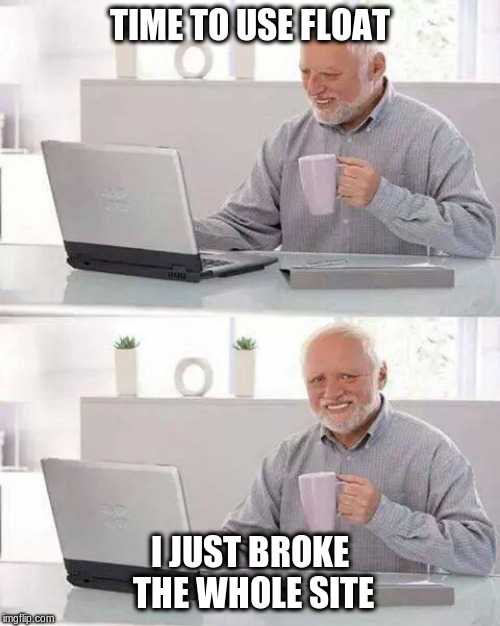

# Tea Cozy - FlexBox Practice

Small project realized going through the full-stack Engineer pro career path at Codecademy.com

## About

Practice on flexbox and responsive design, goal is to use the following design spec to create a single page website.

## Design Spec

## Result

[Deployement](https://maitre-pangolin.github.io/FlexBox_TeaCozy/)